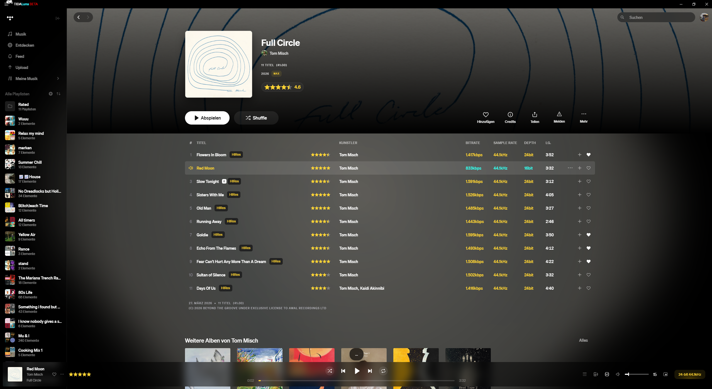

# Star Ratings for TIDAL

An interactive 5-star rating system for [TIDAL](https://tidal.com), built as a [TidaLuna](https://github.com/Inrixia/TidaLuna) plugin. Rate any track straight from the now-playing bar or a track list - a TidaLuna port of [spicetify-star-ratings](https://github.com/brimell/spicetify-star-ratings), adapted and extended for TIDAL.



## Features

- **Rate anywhere** - click the stars in the now-playing bar or on any track-list row. Ratings in 0.5 steps (optional quarter-star mode).
- **Album averages** - album headers show the average of their rated tracks, in a subtle glass pill under the quality badge.
- **Stars coloured by audio quality** - HiRes tracks keep gold stars, everything else turns turquoise.
- **"Rated" folder sync** - on load the plugin finds (or creates) a `Rated` folder of playlists `0.0`-`5.0`. Rating a track adds it to the matching playlist and removes it from the old one; unrating removes it. Your ratings live in these playlists, so they survive reinstalls and sync across devices.
- **Local source of truth** - ratings are stored locally and mirrored to the folder playlists; a fresh install re-imports everything from the folder automatically.
- **Keyboard shortcuts** - `Ctrl+Alt+Numpad 0-9` rates the current track.
- **Weighted playback & playlists** - bias playback toward your higher-rated tracks, or generate a weighted playlist.
- **Play filters** - auto-skip tracks below a threshold, or only play rated / unrated tracks.

## Installation

1. Install [TidaLuna](https://github.com/Inrixia/TidaLuna).
2. In TIDAL, open **Luna Settings → Plugin Store**.
3. Add this store URL:
   ```
   https://github.com/FlazeIGuess/tidaluna-plugins/releases/download/latest/store.json
   ```
4. Install **Star Ratings** from the store.

## Usage

- Hover a track-list row (or look at the now-playing bar) and click a star to rate.
- Clicks on the stars are fully captured - they only set the rating, they never trigger row playback or the full-screen player.
- Rating a song anywhere updates every visible star for that track instantly.
- Open the plugin's settings for granularity, star position, quality colouring, the album average, the "Rated" folder sync, thresholds, keyboard shortcuts and weighted playback.

## Development

Requires [Node.js](https://nodejs.org) and [pnpm](https://pnpm.io).

```sh
pnpm install
pnpm run watch
```

`pnpm run watch` builds with hot reload and serves a DEV store on `http://localhost:3000`, which appears under **Plugin Store** in Luna Settings while developing.

## Credits

- Inspired by [brimell/spicetify-star-ratings](https://github.com/brimell/spicetify-star-ratings).
- Built on [TidaLuna](https://github.com/Inrixia/TidaLuna) by Inrixia.

## License

MIT - see [LICENSE](LICENSE).
