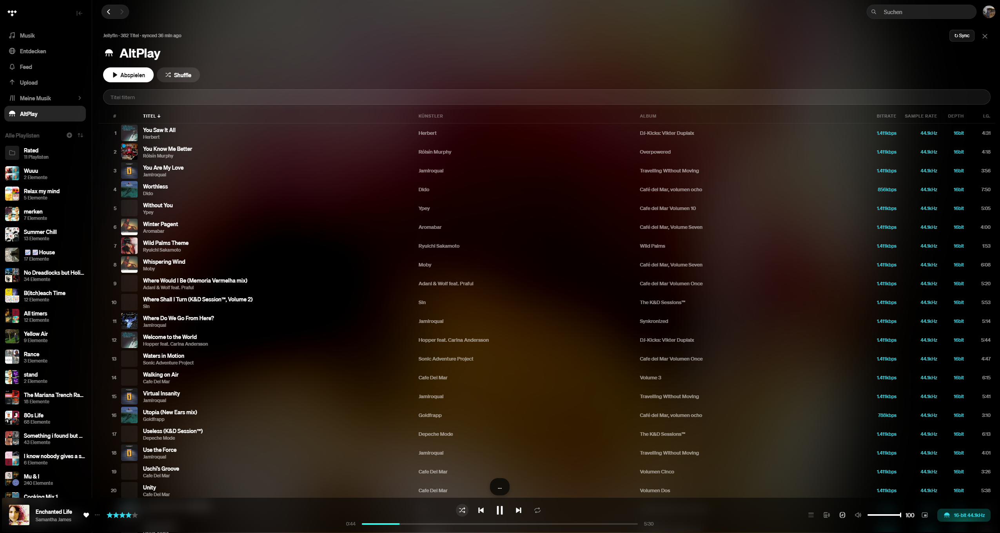
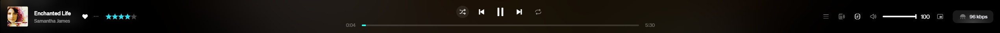
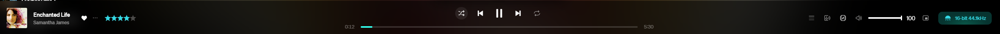
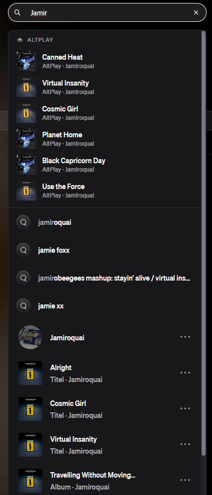

# AltPlay for TIDAL

> ## BETA - work in progress
>
> AltPlay is in an **early beta phase**. It works, but expect rough edges, occasional
> glitches after TIDAL updates, and features that may still change or break. Use it at
> your own risk and please report anything that misbehaves. Do not rely on it as your
> only way to play music.

Play tracks from **your own media servers** (Jellyfin today, more planned) instead of
TIDAL whenever a matching file exists in your library - a [TidaLuna](https://github.com/Inrixia/TidaLuna)
plugin. Got a higher-quality rip, a version TIDAL removed, or something that was never on
TIDAL at all? AltPlay finds it in your library and plays it, while TIDAL's UI keeps
working as usual.



## What it does

> All of the below is **beta** and may not work perfectly in every case.

- **Automatic replacement** - when a track you play on TIDAL strictly matches a file in
  your Jellyfin library, AltPlay swaps the audio to your own stream. TIDAL keeps the
  queue, progress, scrobble and transitions; the provider stream is kept in sync with
  TIDAL's clock.
- **Native mode for shared songs** - if the song also exists on TIDAL, TIDAL plays it
  natively (real artist/album links, full-screen view, lyrics and credits all work) while
  only the audio is served from Jellyfin.
- **Quality-aware badge** - TIDAL's audio-quality badge becomes the AltPlay control. It
  shows the quality of the stream that is actually playing, with a jellyfish marker
  coloured by tier (gold hi-res, teal lossless, grey when TIDAL is playing).
- **Only replace when better** - optional setting to swap in your file **only** when it is
  a higher quality tier than what TIDAL streams. A per-song override always wins.
- **Track-list markers** - rows that have a match in your library show a small jellyfish
  next to the quality tags.
- **AltPlay library page** - a dedicated, TIDAL-styled page (top-level sidebar button)
  listing your whole Jellyfin library: sortable, filterable, with play and shuffle.
  Artist and album open the real TIDAL pages when the song exists there.
- **Footer + full-screen takeover** - songs that exist only on your server play "like any
  other song": the footer player shows their title, artist, cover and progress, and the
  full-screen view uses the Jellyfin artwork.
- **Search integration** - your library shows up in TIDAL's search suggestions in its own
  AltPlay section.
- **Jellyfin sign-in** - connect with **Quick Connect** (no password needed) or the
  classic username and password.

## In action

**Same song, better quality.** Without AltPlay, TIDAL streams this track at 96 kbps:



With AltPlay, the lossless file from your Jellyfin library plays instead - shown by the
jellyfish badge and its quality (16-bit 44.1kHz):



**Your library in TIDAL's search.** Matches from your server appear in their own AltPlay
section at the top of the suggestions:



## Installation

> Requires [TidaLuna](https://github.com/Inrixia/TidaLuna). AltPlay is only tested on the
> desktop TIDAL app.

1. Install [TidaLuna](https://github.com/Inrixia/TidaLuna).
2. In TIDAL, open **Luna Settings → Plugin Store**.
3. Add this store URL:
   ```
   https://github.com/FlazeIGuess/tidaluna-plugins/releases/download/latest/store.json
   ```
4. Install **AltPlay** from the store. It is clearly marked **[BETA]**.

## Setup

1. Open AltPlay's settings in Luna.
2. Enter your Jellyfin server URL (e.g. `http://192.168.1.10:8096`).
3. Sign in with **Quick Connect** (enter the shown code in your Jellyfin app under
   *Settings → Quick Connect*) or with your username and password.
4. AltPlay syncs a local index of your library. Once synced, matches and the library page
   are available.

## Beta status and known limitations

AltPlay is beta software. Please keep in mind:

- Only **Jellyfin** is supported right now. Other providers are planned.
- Matching is strict but not perfect - a wrong or missing match can happen. Use the
  per-song toggle in the badge overlay to force or disable a replacement.
- TIDAL is a moving target. App updates can temporarily break parts of the UI integration
  until the plugin is updated.
- Playback streams through a small local proxy to work around renderer network stalls.
- This is a personal project shared as-is, with no warranty. See the license.

## Development

Requires [Node.js](https://nodejs.org) and [pnpm](https://pnpm.io). From the repository
root:

```sh
pnpm install
pnpm run watch
```

`pnpm run watch` builds with hot reload and serves a DEV store on `http://localhost:3000`,
which appears under **Plugin Store** in Luna Settings while developing.

## Credits

Built on [TidaLuna](https://github.com/Inrixia/TidaLuna) by Inrixia.

## License

MIT - see [LICENSE](../../LICENSE).
